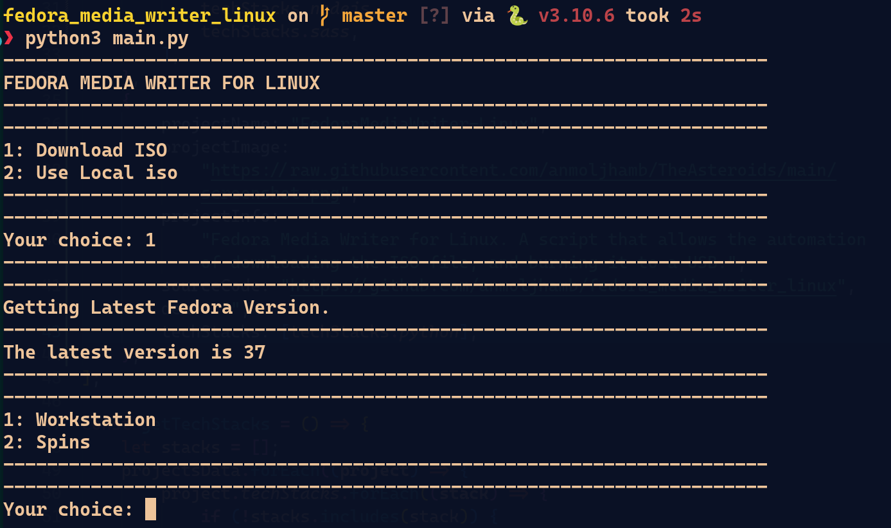

# Fedora Media Writer for Linux

A simple, command-line tool for Linux users to download the latest official Fedora ISO, verify its integrity, and create a bootable USB drive.



-----

## ⚠️ CRITICAL WARNING ⚠️

This script uses tools like `fdisk`, `umount`, and `dd` which can **PERMANENTLY DESTROY ALL DATA** on the selected USB drive. Please double-check the device you select. **Proceed with caution and at your own risk.**

-----

## Features

  * ✅ **Automatic Version Detection**: Scrapes the official Fedora Project mirror to find the latest available release number.
  * 📥 **Flexible Downloads**: Choose between Fedora Workstation or Spins (like KDE, XFCE, etc.) and download the correct ISO for your system (`x86_64`).
  * 🔑 **Checksum Verification**: Automatically downloads the official `CHECKSUM` file and uses `shasum` to verify the integrity of the downloaded ISO, ensuring it's not corrupt.
  * 💾 **Bootable USB Creation**:
      * Identifies available USB devices on your system.
      * Unmounts the selected device safely.
      * Formats the drive (VFAT for EFI systems, EXT4 for legacy).
      * Uses `dd` to perform a block-level copy of the ISO to the USB.
  * 📂 **Use Local ISO**: Already have an ISO? You can skip the download and verification steps and proceed directly to burning a local ISO file.

-----

Of course. Here are the updated "Prerequisites" and "Installation" sections for your `README.md`, reflecting the change to a single installation command.

-----

## Prerequisites

Before running this script, you need to have Python 3 and a few system utilities installed.

### System Dependencies

This script is designed for Linux and relies on the following command-line tools. Most modern distributions have them pre-installed.

  * `fdisk`
  * `umount`
  * `mkfs.vfat` / `mkfs.ext4`
  * `dd`
  * `shasum`

### Python Packages

You'll need the following Python libraries, which can be installed using `pip`:

  * `requests`
  * `beautifulsoup4`
  * `lxml`
  * `wget`

-----

## Installation

1.  **Clone the repository:**

    ```bash
    git clone <your-repo-url>
    cd <your-repo-directory>
    ```

2.  **Install Python dependencies:**
    Run the following command to install all the required libraries in a single step:

    ```bash
    pip install requests beautifulsoup4 lxml wget
    ```
-----

## Usage

Because the script performs low-level operations like formatting and writing to a disk device, it **must be run with `sudo`**.

```bash
sudo python3 main.py
```

The script will guide you through the following steps:

1.  **Choose your source**: You'll be asked if you want to `Download ISO` or `Use Local iso`.
2.  **If downloading**:
      * It will find the latest Fedora version.
      * You'll choose between `Workstation` and `Spins`.
      * You'll select the specific ISO to download.
      * The script will download the ISO and its checksum, then verify it.
3.  **If using a local file**:
      * You'll be prompted to enter the full path to your `.iso` file.
4.  **Select the USB Drive**:
      * The script will list all detected USB drives (e.g., `/dev/sdb`, `/dev/sdc`).
      * **CAREFULLY** select the correct device from the list.
5.  **Final Confirmation**:
      * You will be asked for a final confirmation before the data on the USB is erased.
6.  **Burning Process**:
      * The script will unmount, format, and burn the ISO to the selected USB. The progress of the `dd` command will be displayed on the screen.

-----

## How It Works

The project is broken down into several modules:

  * `main.py`: The main entry point that orchestrates the entire workflow, from user input to calling the other modules.
  * `DownloadISO.py`: Handles all networking. It scrapes the Fedora mirror website (`https://dl.fedoraproject.org/pub/fedora/linux/releases`) to find available versions and ISO files. It uses `wget` to download the chosen ISO and the `CHECKSUM` file.
  * `VerifyHash.py`: Takes the downloaded ISO and the `CHECKSUM` file as input. It parses the checksum file to find the correct SHA256 hash for the ISO and uses the system's `shasum` command to validate the file's integrity.
  * `BurnUSB.py`: Manages all disk operations. It uses `sudo fdisk -l` to find USB devices, `umount` to unmount them, `mkfs` to format, and `dd` to write the ISO image to the device.
  * `functions.py`: A utility module containing helper functions for creating the command-line interface, such as taking user input and clearing the screen.
